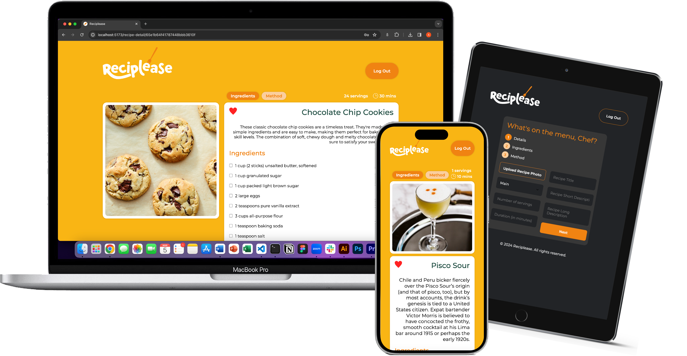

# Reciplease

### A full-stack MERN app which acts as a central repository for its users’ recipes.

### What is Reciplease?

We've all encountered the frustration of having recipes scattered across websites, cookbooks, magazines and handwritten notes. Reciplease aims to solve this problem by providing a central hub for all of your recipes, regardless of their origin. This allows you to easily organise, access, and personalise your favourite culinary creations, all in one convenient place.

### Technologies

Choosing the right tools was important to create this app within the one week deadline. Figma helped me to design the app's interface, while Node.js, Express, MongoDB and Mongoose combined to build the robust backend. React brought the frontend to life using Zustand as a global state manage, Cloudinary to provide a seamless solution for image storage and React-Toastify to add helpful pop-up notifications throughout the app.

### Features

- Log In/Register page
- A dashboard of the users recipes
- A three step form to create recipes
- The ability to filter recipes based on their category, if they are a favourite or through a search query
- Each recipe on the dashboard links to its own recipe detail page where users can see the details, ingredients and method

I have also implemented responsiveness across a range of devices and dark mode:

### Challenges

Mastering atomic commits, preventing data mutation in React, and diving into a new state manager, Zustand, all presented their own challenges.

### Future developments

I plan to enable:

- Recipe editing
- Smoother carousel navigation on the dashboard
- A robust authentication system using JWT
- The integration of the Edamam API’s recipe search to provide users with recipes based off of their available ingredients
  A longer-term goal is to make the app more of a social platform where users can share their recipes between themselves.

### **How to Install and Run the Project**

**Prerequisites:**

- Ensure you have MongoDB installed and running on your system.
  **Instructions:**

1. Clone the repository:
   `git clone <repository_url>`

2. Install dependencies:
   - Navigate to the *server* folder and run:
     `npm install`
   - Navigate to the *client* folder and run:
     `npm install`
3. Start the server:
   - Open a terminal window, navigate to the *server* folder and run:
     `npm start`
4. Start the client:

   - Open another terminal window, navigate to the *client* folder and run:
     `npm run dev`
   - Open the link in your browser to display the Reciplease app (default link: `http://localhost:5173/`)

   **Note:** You may need to adjust the port numbers if you have other applications using port 3000 (the server’s default port) or port 5173 (the frontend’s default port).

5. Create an account to begin using Reciplease
