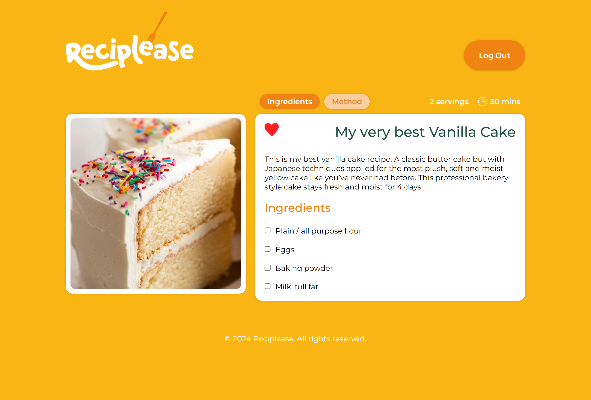
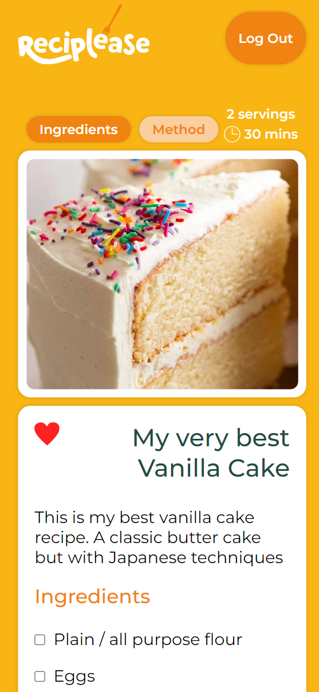

## A full-stack MERN app which acts as a central repository for its users’ recipes.

### What is Reciplease?

Reciplease tackles the common annoyance of juggling recipes from various sources like websites, books, and scribbles. It offers a one-stop solution where you can neatly gather, manage, and customize your go-to recipes in a handy spot.

### Features

- A sign-in/sign-up interface
- A personalized panel displaying the user's recipe collection
- A simple, three-part process for adding new recipes
- Features to sort recipes by type, mark as favorites, and search functionality
- Clickable recipes that lead to a detailed page showcasing the recipe's specifics, components, and preparation steps

Responsiveness across a range of devices and dark mode:

## Contributors

- **Gabe Mata** - Refactored the codebase to TypeScript, integrated end-to-end testing with Cypress, and developed new modular components.

### **How to Install and Run the Project**

**Prerequisites:**

- Ensure you have MongoDB installed and running on your system.

**Instructions:**

1. Fork the repositiory

2. Clone the repository in your chosen destination:
   `git clone https://github.com/freeflyaz/reciplease/`

3. Install dependencies:
   - Navigate to the *server* folder and run:
     `npm install`
   - Navigate to the *client* folder and run:
     `npm install`
4. Start the server:
   - Open a terminal window, navigate to the *server* folder and run:
     `npm start`
5. Start the client:

   - Open another terminal window, navigate to the *client* folder and run:
     `npm run dev`
   - Open the link in your browser to display the Reciplease app (default link: `http://localhost:5173/`)

   **Note:** You may need to adjust the port numbers if you have other applications using port 3000 (the server’s default port) or port 5173 (the frontend’s default port).

6. Create an account to begin using Reciplease
